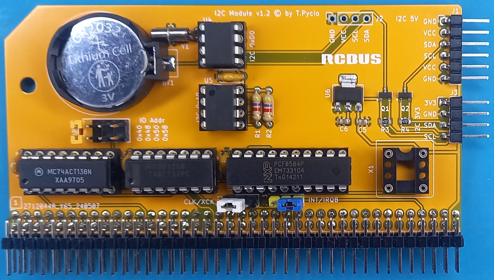

# PCF8584 I2C module for RCBus

I2C module for RCBus systems.

## Hardware Documentation

### Schematic

[Schematic - Version 1.0](schematic.pdf)

## Bill of Materials

| Component type     | Reference | Description                                               | Quantity |
| ------------------ | --------- | --------------------------------------------------------- | -------- |
| PCB                |           | I2C Module - Version 1.2                                  | 1        |
| Integrated Circuit | U1        | PCF8584, 20 pin DIP                                       | 1        |
| Integrated Circuit | U2        | 74HCT138 - 3-to-8 line decoder, 16 pin DIP                | 1        |
| Integrated Circuit | U3        | 74HCT32 - Quad 2-input OR gate, 14 pin DIP                | 1        |
| Integrated Circuit | U4        | DS1307 - RTC, 8 pin DIP                                   | 1        |
| Integrated Circuit | U5        | 24C02-64 - EEPROM, 8 pin DIP                              | 1        |
| Integrated Circuit | U6*       | AP1117-33 - low dropout positive regulator 3V3, SOT-223-3 | 1        |
| Resistor           | R1,R2     | 4.7 kohm, 0.25 W, axial                                   | 2        |
| Resistor           | R3*,R4*   | 4.7 kohm, SMD 0805                                        | 2        |
| Capacitor          | C1 - C4   | 0.1 uF, 50V, MLCC, 2.5 mm pitch                           | 4        |
| Capacitor          | C5*,C6*   | 10uF, ceramic, SMD 0805                                   | 2        |
| Crystal            | Y1        | 32768 Hz                                                  |          |
| Oscillator         | X1**      | 12 MHz, CMOS oscillator, half can                         | 1        |
| Connector          | S1        | 2x40 pin header, 2.54 mm pitch, angle                     | 1        |
| Pin Header         | J1        | 6 pin header, 2.54 mm pitch, angle                        | 1        |
| Pin Header         | JP1, JP3  | 3 pin header, 2.54 mm pitch                               | 2        |
| Pin Header         | JP2       | 2x4 pin header, 2.54 mm pitch                             | 1        |
|                    |           | 0.1 uF, 50V, MLCC, 2.5 mm pitch                           | 4        |
| IC Socket          | U1        | 28 pin DIP                                                | 1        |
| IC Socket          | U2        | 32 pin DIP                                                | 1        |
| IC Socket          | U3        | 16 pin DIP                                                | 1        |
| IC Socket          | U4 - U6   | 14 pin DIP                                                | 3        |

Gerber files prepared for production at JLCPCB

## Release Notes

### Changes

* Version 1.2
  
  * Initial public version

## License

Copyright 2025 Tadeusz Pycio

This work is licensed under a [Creative Commons Attribution-NonCommercial 4.0 International (CC BY-NC 4.0) ](https://creativecommons.org/licenses/by-nc/4.0/).
