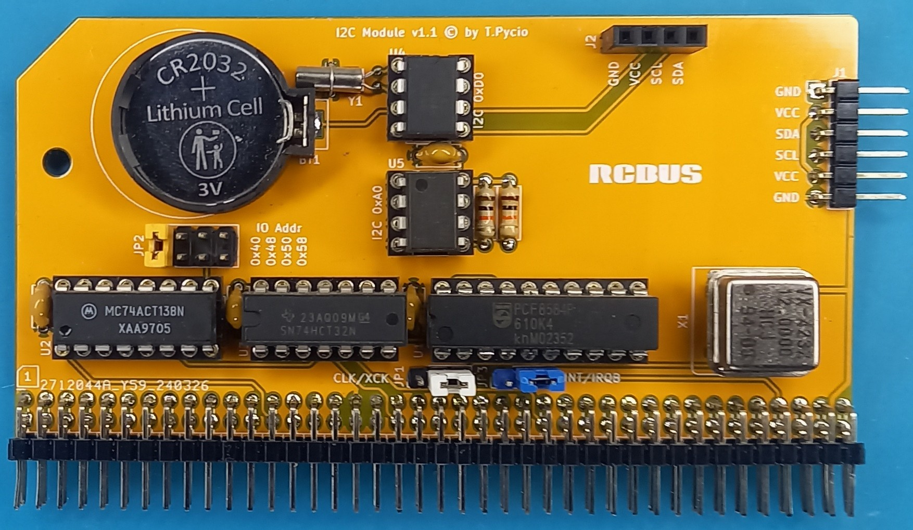
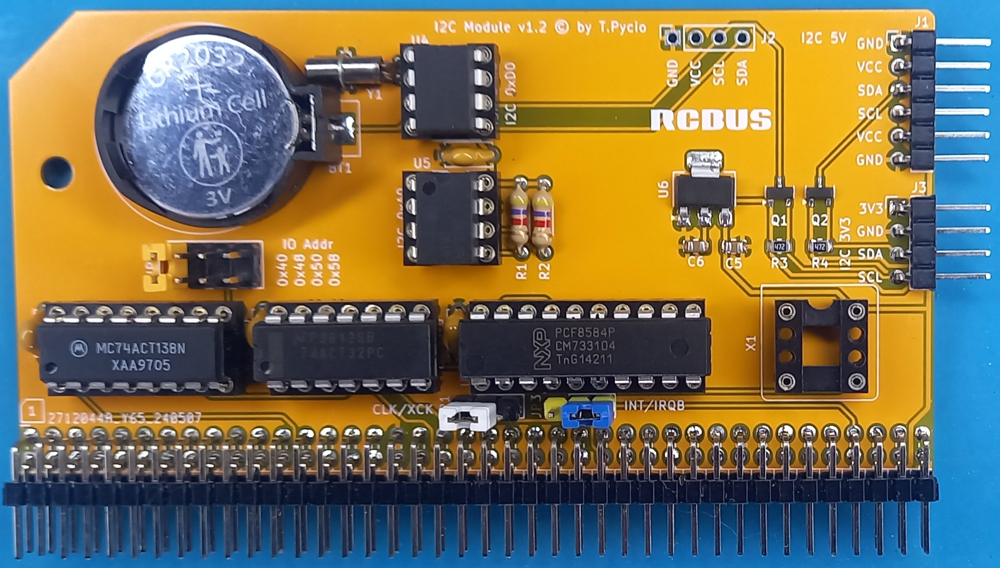

## PCF8584 I2C module for RCBus

I2C module for RCBus systems.

Version 1.1 (5V only)

Version 1.2 (5V & 3.3V)

## Hardware Documentation

#### Schematic

[Schematic](Schematic.pdf)

## Jumpers and Connectors

#### JP1 - Clock source

| Position      | Description     |
| ------------- | --------------- |
| 1-2 (default) | from bus        |
| 2-3           | from oscillator |

#### JP2 -  I/O address select

| Position | Description       |
| -------- | ----------------- |
| 1-2      | I/O address: 0x40 |
| 3-4      | I/O address: 0x48 |
| 5-6      | I/O address: 0x50 |
| 7-8      | I/O address: 0x58 |

#### JP3 - Interrupt select

| Position | Description       |
| -------- | ----------------- |
| 1-2      | /INT              |
| 2-3      | /IRQB             |
| open     | interrupt not use |

#### J1 - I2C external connector

| 1   | 2   | 3   | 4   | 5   | 6   |
| --- | --- | --- | --- | --- | --- |
| GND | +5V | SDA | SCL | +5V | GND |

The connector is compatible with [SC400](https://smallcomputercentral.com/i2c-bus-modules/) series I2C bus modules.

#### J2 - Internal I2C interface

| 1   | 2   | 3   | 4   |
| --- | --- | --- | --- |
| GND | +5V | SCL | SDA |

The connector allows the connection of a 0.96" OLED display.

NOTE: Two different models of these displays are available, differing in the way they are powered. Connecting the wrong model will damage it!

#### J3* - External 3V3 I2C connector

| 1     | 2   | 3   | 4   |
| ----- | --- | --- | --- |
| +3.3V | GND | SDA | SCL |

## Bill of Materials

| Component type     | Reference | Description                                                   | Quantity |
| ------------------ | --------- | ------------------------------------------------------------- | -------- |
| PCB                |           | I2C Module - Version 1.2                                      | 1        |
| Integrated Circuit | U1        | PCF8584, 20 pin DIP                                           | 1        |
| Integrated Circuit | U2        | 74HCT138 - 3-to-8 line decoder, 16 pin DIP                    | 1        |
| Integrated Circuit | U3        | 74HCT32 - Quad 2-input OR gate, 14 pin DIP                    | 1        |
| Integrated Circuit | U4        | DS1307 - RTC, 8 pin DIP                                       | 1        |
| Integrated Circuit | U5        | 24C02-64 - EEPROM, 8 pin DIP                                  | 1        |
| Integrated Circuit | U6*       | AP1117-33 - low dropout positive regulator 3V3, SMD SOT-223-3 | 1        |
| Transistor         | Q1*,Q2*   | 2N7002, SMD SOT-23                                            | 2        |
| Resistor           | R1,R2     | 4.7 kohm, 0.25 W, axial                                       | 2        |
| Resistor           | R3*,R4*   | 4.7 kohm, SMD 0805                                            | 2        |
| Capacitor          | C1 - C4   | 0.1 uF, 50V, MLCC, 2.5 mm pitch                               | 4        |
| Capacitor          | C5*,C6*   | 10uF, ceramic, SMD 0805                                       | 2        |
| Crystal            | Y1        | 32768 Hz crystal                                              | 1        |
| Oscillator         | X1**      | 12 MHz, CMOS oscillator, half can                             | 1        |
| Connector          | S1        | 2x40 pin header, 2.54 mm pitch, angle                         | 1        |
| Pin Header         | J1        | 6 pin header, 2.54 mm pitch, angle                            | 1        |
| Pin Socket         | J2        | 4 pin socket, 2.54mm pitch                                    | 1        |
| Pin Header         | J3        | 4 pin header, 2.54 mm pitch, angle                            |          |
| Pin Header         | JP1, JP3  | 3 pin header, 2.54 mm pitch                                   | 2        |
| Pin Header         | JP2       | 2x4 pin header, 2.54 mm pitch                                 | 1        |
| Battery Holder     | BT1       | Battery Holder CR2032                                         | 1        |
| IC Socket          | U1        | 20 pin DIP                                                    | 1        |
| IC Socket          | U2        | 16 pin DIP                                                    | 1        |
| IC Socket          | U3        | 14 pin DIP                                                    | 1        |
| IC Socket          | U4 - U8   | 8 pin DIP                                                     | 2        |
| IC Socket          | X1        | 4 pin DIP for oscillator                                      | 1        |

Gerber files prepared for production at JLCPCB

* [Version 1.1](RTCMem11.zip)

* [Version 1.2](RTCMem12.zip)

## Release Notes

(*) Not available in version 1.1, for version 1.2 it is optional.
(**) Quartz oscillator is required for systems with a system clock greater than 12MHz.

## Changes

* Version 1.1 (5V only) & 1.2 (5V/3v3)
  
  * Initial public version

## License

Copyright 2025 Tadeusz Pycio

This work is licensed under a [Creative Commons Attribution-NonCommercial 4.0 International (CC BY-NC 4.0) ](https://creativecommons.org/licenses/by-nc/4.0/).
